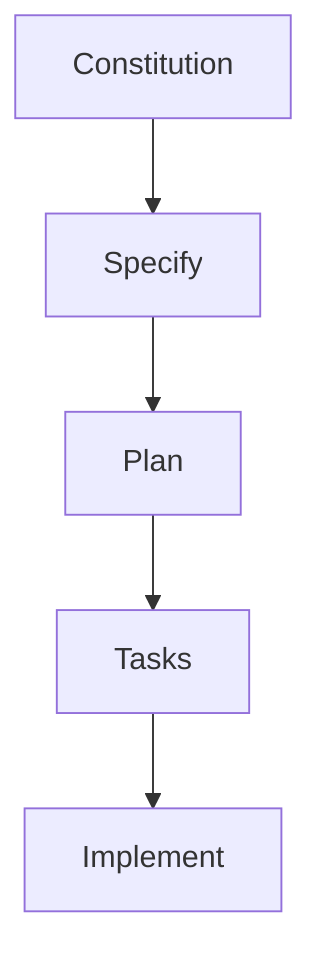
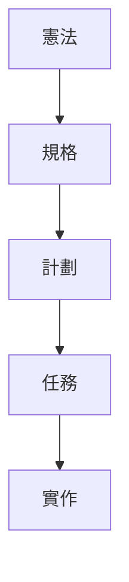

- reference:
```text
大家好，我是奶綠
今天來和大家分享最近很火熱的一種開發模式 SDD 規格驅動。

SDD 全名為 Spec Driven Development，規格驅動開發，也就是先有 spec 規格書，經由專業的人員審視過後才進行開發。
這樣的優點就是有明確的規格書，AI 能夠更精準的知道這個專案要做些什麼。

來實際走一次看看 SDD：
先到 https://github.com/github/spec-kit 讀一下 README.md 文件。
並請先確認你有安裝 python 環境。

Step1：Get Started
安裝 specify cli，文件有兩種安裝方式，
在這奶綠我選擇 Option 2: One-time Usage，
選擇這個方案是因為這樣可以確保是最新的 specify cli 版本。

uvx --from git+https://github.com/github/spec-kit.git specify init <PROJECT_NAME>
如果想要在現有的專案資料夾使用的話，拿掉 <PROJECT_NAME>
並加上參數 — here 即可。

uvx --from git+https://github.com/github/spec-kit.git specify init --here
spec-kit 支援多種 AI assistant，選一個你用的上手的吧，奶綠我選用 claude

Press enter or click to view image in full size

選擇 script type，如果你是 Mac，就選 sh，Windows 選 ps

Press enter or click to view image in full size

設定完成後，spec-kit 就有 Next Steps 和你說下一步怎麼做。

Press enter or click to view image in full size

接著啟動 Claude Code，使用 slach command 時，就會出現 speckit 相關的指令。

Press enter or click to view image in full size

Step2: Establish project principles
使用 /speckit.constitution來建立專案的原則。
constitution 翻譯成中文是憲法，也就是整個專案的最高原則，是不可違背的。

官方範例使用了這段：

/speckit.constitution Create principles focused on code quality, testing standards, user experience consistency, and performance requirements
奶綠我的版本，加了使用 MVP，不要 overdesign，避免 AI 加了過多幻想的功能。

這句 prompt 很重要，所以要說三次：
使用 MVP，不要 overdesign
使用 MVP，不要 overdesign
使用 MVP，不要 overdesign

/speckit.constitution 建立高品質，可被 testable，mininum viable product(MVP)，不要 overdesign，一率使用正體中文
完成後，就會在專案資料夾自動建立 .specify/memory/consitution.md 檔

Step3: Create the spec
使用 /speckit.specify 建立想要的功能，重點放在 what and why，這裡不要提到含任何的 tech stack。
奶綠平常有練吉他的習慣，那我們就來開發一個 Web 版 Metronome 吧。

/speckit.specify 
建立一個 Metronome Web App，拍子需要精準，
需要有 scrollbar 能調整 BPM 的速度，
有 Button 能切換 3 小節或是 4 小節，
第一拍的音效要為重音
完成後會在專案建立 specs/001-metronomne-web-app/spec.md 和 requirements.md 檔。

Press enter or click to view image in full size

這時候 spec-kit 的優點就出現了，如果你的 spec 有不清楚的地方，在這個階段 AI 就會主動提出需要澄清的問題。
這時就可以使用 /speckit.clarify 來針對 AI 提出的問題做進一步的說明，讓 spec 更加精準。

Become a member
而且會自動幫你建立 git branch，真的超推的。

Step4: Create a technical implementation plan
使用 /speckit.plan建立技術文件，在這就可以決定要用什麼樣的技術開發。

官方範例：

/speckit.plan The application uses Vite with minimal number of libraries. Use vanilla HTML, CSS, and JavaScript as much as possible. Images are not uploaded anywhere and metadata is stored in a local SQLite database.
奶綠的版本：

/speckit.plan
使用 vite, react, typescript, tailwindcss@3 建立 web app，
UI library 使用 shadcn，
使用 vitest 做為 unit-test library，
不要使用 JavaScript setInterval 做為播放拍子的函式，因為時間會不精準
完成。

Press enter or click to view image in full size

Step5: Break down into tasks
使用 /speckit.tasks 建立可執行的任務列表。這裡不需要帶入任何的 prompt 文字，直接輸入該 command line 即可。

完成。會發現 spec-kit 自帶 TDD 開發，真是太讚了，完全不需要另外設定。

Press enter or click to view image in full size

Step6: Execute implementaion
使用 /speckit.implement 就可以請 AI 開工啦。
這裡 spec-kit 還有些選選能夠讓你選，可以看這個任務的情境，是 feature 開發，還是 POC。

因為奶綠我剛好要出門，又懶的每個 permission allow，就決定打開 claude code yolo mode。

claude --dangerously-skip-permissions

然後跟 AI 說：
我等會要出門，希望 2 小時候後所有的 tasks 都可以完成，如果有卡住或是 test 失敗 2 次，你先 skip 掉，並留下 comment： 這個我修不好，需要專業的奶綠大大來處理 ，並請忽略所有的 eslint 錯誤，加油，你可以的

Press enter or click to view image in full size

附上有設計師製作的精美 workflow 圖表：
https://github.com/github/spec-kit/issues/467

一些奶綠的個人心得：
有明確的規格可以讓團隊有個對焦的文件，畢竟每個人對文字的理解是不一樣的，而且 AI 是可以協助理清不明確的需求。

plan 這個階段真的超重要的，這裡就需要專業的 RD 提供精準的 tech stack，像是用 vue 還是 react，用什麼 testing libray，用什麼 state manager，這些都是需要 RD 累積的開發經驗。

人類在 SDD 模式下，review 文件變得更重要，spec-kit 每個 Step 產生的文件都需要專業人員 review，確保是你想要的。

最後 Coding 這麼簡單的事，就交給 AI 吧，人類就只要負責喝酒吃餅干，然後最後跟 AI 說，Good job。

不要再相信 “不需要程式背景，也可以開發出百萬級應用程式”
下圖是一個社群流傳的圖片，我想身為專業工程師的你，這個發文也只能會心一笑。

Developers are increasingly relying on AI agents to both build new software as well as extend capabilities of existing projects that they support. One challenge with AI-based systems, however, is that to produce the right output you need to first establish really good context. If you don’t decide what you’re building and why you’re building it ahead of time, the codebase becomes the de-facto specification – a collection of seemingly disjoint components that can work together but are hard to maintain, evolve, and debug.

Code is really not the best medium for requirements negotiation – nobody wants to write the code first and then incrementally make adjustments as requirements start emerging and technical architecture locks developers to a solution. Code is inherently a binding artifact – once you write an implementation, it’s very hard to decouple from it. Any major rewrites or experiments will undoubtedly require a lot of effort from a large team.

This is why last week GitHub announced Spec Kit.

GitHub Spec Kit brings a new approach to AI-based software development workflows – instead of vibe coding every new feature and bug fix teams can preemptively outline the concrete project requirements, motivations, and technical aspects before handing that off to AI agents and have them build exactly what was needed in the first place. If you’ve ever worked with product managers that had to put together Product Requirements Documents (PRDs) that need to be reviewed and then implemented, you might hear some echoes of a familiar process.

What Is Spec-Driven Development
Spec-Driven Development, or SDD, is not about writing exhaustive, dry requirements documents that nobody reads. It’s also not about waterfall planning or trying to predict the future through extensive planning exercises. And it’s definitely not about creating more bureaucracy that slows engineering teams down.

SDD is about making your technical decisions explicit, reviewable, and evolvable. Think of it as version control for your thinking. Instead of having crucial architectural decisions trapped in email threads, scattered documents, or locked in someone’s head, you capture the “why” behind your technical choices in a format that can grow with your project and your understanding of the problem space.

Picture this: You’re three sprints into building a notification system. The PM thought “notification preferences” meant per-channel toggles. The backend engineer built it as a single on/off switch. The frontend developer assumed it would integrate with the user’s OS notification settings. And the designer? They mocked up something that would require rebuilding half the user service. This isn’t a failure of communication – it’s a failure of shared context. Everyone made reasonable assumptions based on incomplete information. SDD gives you a lightweight way to surface those assumptions early, when changing direction costs a few keystrokes instead of entire sprints.

Specs become living documents that evolve alongside your code, not dusty artifacts that you write once and forget. They are active tools that help you think through edge cases, coordinate across teams, and onboard new people. When done right, updating the spec becomes as natural as refactoring code – without actually touching any code.

This is especially critical for processes that rely on AI agents to build products as shared context becomes a valuable asset that can steer the agent to the right solution. Because specifications are themselves detached from code, it’s possible to go as far as to create multi-variant implementations with ease. Curious about the performance difference between one component written in Rust and another in Go is? Ask the AI agent to produce two completely different implementations based on the spec. Exploring several design directions for a feature? Ask the AI agent to create several implementations that rely on different Figma mocks exposed through the Figma MCP server. SDD unlocks new scenarios that are not reliant on one rigid implementation.

This is where GitHub Spec Kit comes in.

Getting Started with Spec Kit
GitHub Spec Kit is our approach to bringing SDD practices to life. To get a full overview of the GitHub Spec Kit project, you can start by watching the guide video on this project:


GitHub Spec Kit has two key components that will be interesting for us to explore:

Specify CLI. A helper CLI that bootstraps your projects for SDD. It downloads the official templates from the GitHub repo for the coding agent and platform of your choice and sets up the SDD scaffolding in a way that the agent can start iterating on it.
A set of templates and helper scripts. This establishes the foundation for our SDD experience. Templates define what a spec looks like, what a technical plan encompasses for a given project, and how all of this is broken down into individual tasks that an AI agent can pick up and execute.
There is no magic beyond these two parts of the toolkit. You can even manage templates manually if you download them from the Releases tab in the GitHub repo and extract directly within your project folder. GitHub Spec Kit was designed to work in the environment you’re already building your software in.

Specify CLI
A big part of GitHub Spec Kit is the built-in CLI. The Specify CLI is a Python-based tool that can be used to quickly set your project up for SDD. You can install it directly with the help of uvx and bootstrap your project in just one command:

Copy
uvx --from git+https://github.com/github/spec-kit.git specify init <PROJECT_NAME>
When you run Specify, you will be prompted to select one of the supported coding agents. Specify is cross-agent by default – the built-in templates are designed in a way that makes the compatible with most modern agents without any tweaks. Specify will ensure that it downloads the right version for the agent that you’re building with.

The bundled helper scripts are also available in two flavors. For POSIX-compatible systems, like Linux, macOS, or even inside Windows Subsystem for Linux, you can use shell scripts. On native Windows environments – PowerShell scripts are right there as well.

Specify CLI running in the Windows Terminal, image

Once Specify bootstraps the project, you will see two new folders created within your project – .github and .specify:

Copy
├───.github
│   └───prompts
│           plan.prompt.md
│           specify.prompt.md
│           tasks.prompt.md
│
└───.specify
    ├───memory
    │       constitution.md
    │       constitution_update_checklist.md
    │
    ├───scripts
    │   └───powershell
    │           check-task-prerequisites.ps1
    │           common.ps1
    │           create-new-feature.ps1
    │           get-feature-paths.ps1
    │           setup-plan.ps1
    │           update-agent-context.ps1
    │
    └───templates
            agent-file-template.md
            plan-template.md
            spec-template.md
            tasks-template.md
The .specify folder contains all of the SDD templates, such as the ones for the spec, technical plan, and tasks, along with the scripts for the platform you chose. The agent-specific folder, such as .github for GitHub Copilot, will contain the prompt definitions that can help you follow the SDD process without manually typing the actual process requirements. Agent-specific prompts can also most commonly be used through slash commands – in our case, /specify, /plan, and /tasks.

In addition to the above, GitHub Spec Kit introduces an extra file that you might not have seen before – constitution.md. In the SDD context, a constitution document establishes a set of non-negotiable principles for your project. For example, your organization might have a set of requirements around testing approaches for web applications. Or maybe there is a convention where every application that is being built by a specific team should always be CLI-first. All of these can be captured in the constitution document before any of the SDD-based iteration is tackled. This is also a powerful tool for organizations to establish opinionated stacks – a set of conventions that guide the development and evolution of every new and existing project.

And of course – the helper scripts that are in the powershell or bash folders are invoked from within individual prompts to help ensure that the SDD scaffolding is applied consistently. When Specify first bootstraps your project it ensures that it either is inside an existing Git repository or, if not, is creating one for you. The scripts then help the agent manage source consistency and ensure that all operations are done within the same feature branch, as well as that all subsequent prompts have proper references to previously-created artifacts, such as the spec, the plan, and the data contracts that the agent generated for your project.

Slash Commands
To make it easier to follow the SDD process, we introduced three slash commands that are available for all supported coding agents:

Command	Description
/specify	Outline the “what” and the “why” of your project. This is what will be used to bootstrap the Product Requirements Document (PRD) for your project, feature, or change. This step explicitly excludes technical decision making – you’re not defining the tech stack but rather focus on motivations and functional requirements.
/plan	Outline the “how” of the project – what frameworks, libraries, databases, or infrastructure needs to be used. This will generate a plan, along with additional metadata, such as research, data contracts, and a quickstart that will outline how your teammates can get started with building and experimenting with the projects. This plan is grounded by the constitution we mentioned above, ensuring that all decisions fit with the prescriptive guidance you’ve established.
/tasks	Breaks down the spec and plan into manageable, phased chunks that the AI agent can tackle to implement the project.
Each slash command has to be used sequentially – first, you create the spec with /specify. Then, you establish the technical requirements with /plan. Next, you break this down into manageable chunks with /tasks.

Once you’re satisfied with the requirements, plan, and task breakdown – simply ask your agent to implement the project based on the outlined tasks.

Using the /specify command in VS Code, image

It’s worth noting that as you are using the slash commands that Specify injected into the project, having a very detailed first prompt will produce a much better specification that the agent can use for further project buildouts.

Think through the project requirements and what you want and don’t want to see in the final output. For the specification, are there particular experiences that are critical to the success of what you are building? For the technical plan, how important is it to pick a specific library instead of letting AI make that choice for you? The more detail you can bake into the guiding prompt, the more likely you are to spend less time tweaking the produced documents.

As you go through individual steps, your AI agent will create new artifacts within the specs folder. You can review and adjust them manually or with the help of your agent – they’re plain Markdown files and you can easily change them as you see fit for your project.

While the SDD process itself is flexible and gives you a lot of control over the project details, GitHub Spec Kit bakes in some assumptions around how projects are built. You can see those when you inspect any of the bundled templates. If you feel that one or more parts of the scaffolding are not what you want for your project, feel free to modify the prompts and the templates that are provided inside the .specify folder to fit your needs. The scaffolding that is provided out-of-the-box is an example implementation that we’ve seen successfully used for a range of projects, but it certainly can be extended and tweaked to fit specific organizational requirements.

We Want Your Feedback
First and foremost, GitHub Spec Kit is an experiment – there are a lot of questions that we still want to answer, and if community feedback is an indicator, there are quite a few features we can still add to make the SDD process easier to use. We’re so thankful by the overwhelmingly positive reception of this project in the past week, and are looking forward to growing it and learning from the experiences of developers who adopt it in their projects.

If you’ve tried it and see that something is missing, not working, or just can be improved – open an issue.

We look forward to seeing what you build with GitHub Spec Kit and SDD!

Developers are increasingly relying on AI agents to both build new software as well as extend capabilities of existing projects that they support. One challenge with AI-based systems, however, is that to produce the right output you need to first establish really good context. If you don’t decide what you’re building and why you’re building it ahead of time, the codebase becomes the de-facto specification – a collection of seemingly disjoint components that can work together but are hard to maintain, evolve, and debug.

Code is really not the best medium for requirements negotiation – nobody wants to write the code first and then incrementally make adjustments as requirements start emerging and technical architecture locks developers to a solution. Code is inherently a binding artifact – once you write an implementation, it’s very hard to decouple from it. Any major rewrites or experiments will undoubtedly require a lot of effort from a large team.

This is why last week GitHub announced Spec Kit.

GitHub Spec Kit brings a new approach to AI-based software development workflows – instead of vibe coding every new feature and bug fix teams can preemptively outline the concrete project requirements, motivations, and technical aspects before handing that off to AI agents and have them build exactly what was needed in the first place. If you’ve ever worked with product managers that had to put together Product Requirements Documents (PRDs) that need to be reviewed and then implemented, you might hear some echoes of a familiar process.

What Is Spec-Driven Development
Spec-Driven Development, or SDD, is not about writing exhaustive, dry requirements documents that nobody reads. It’s also not about waterfall planning or trying to predict the future through extensive planning exercises. And it’s definitely not about creating more bureaucracy that slows engineering teams down.

SDD is about making your technical decisions explicit, reviewable, and evolvable. Think of it as version control for your thinking. Instead of having crucial architectural decisions trapped in email threads, scattered documents, or locked in someone’s head, you capture the “why” behind your technical choices in a format that can grow with your project and your understanding of the problem space.

Picture this: You’re three sprints into building a notification system. The PM thought “notification preferences” meant per-channel toggles. The backend engineer built it as a single on/off switch. The frontend developer assumed it would integrate with the user’s OS notification settings. And the designer? They mocked up something that would require rebuilding half the user service. This isn’t a failure of communication – it’s a failure of shared context. Everyone made reasonable assumptions based on incomplete information. SDD gives you a lightweight way to surface those assumptions early, when changing direction costs a few keystrokes instead of entire sprints.

Specs become living documents that evolve alongside your code, not dusty artifacts that you write once and forget. They are active tools that help you think through edge cases, coordinate across teams, and onboard new people. When done right, updating the spec becomes as natural as refactoring code – without actually touching any code.

This is especially critical for processes that rely on AI agents to build products as shared context becomes a valuable asset that can steer the agent to the right solution. Because specifications are themselves detached from code, it’s possible to go as far as to create multi-variant implementations with ease. Curious about the performance difference between one component written in Rust and another in Go is? Ask the AI agent to produce two completely different implementations based on the spec. Exploring several design directions for a feature? Ask the AI agent to create several implementations that rely on different Figma mocks exposed through the Figma MCP server. SDD unlocks new scenarios that are not reliant on one rigid implementation.

This is where GitHub Spec Kit comes in.

Getting Started with Spec Kit
GitHub Spec Kit is our approach to bringing SDD practices to life. To get a full overview of the GitHub Spec Kit project, you can start by watching the guide video on this project:


GitHub Spec Kit has two key components that will be interesting for us to explore:

Specify CLI. A helper CLI that bootstraps your projects for SDD. It downloads the official templates from the GitHub repo for the coding agent and platform of your choice and sets up the SDD scaffolding in a way that the agent can start iterating on it.
A set of templates and helper scripts. This establishes the foundation for our SDD experience. Templates define what a spec looks like, what a technical plan encompasses for a given project, and how all of this is broken down into individual tasks that an AI agent can pick up and execute.
There is no magic beyond these two parts of the toolkit. You can even manage templates manually if you download them from the Releases tab in the GitHub repo and extract directly within your project folder. GitHub Spec Kit was designed to work in the environment you’re already building your software in.

Specify CLI
A big part of GitHub Spec Kit is the built-in CLI. The Specify CLI is a Python-based tool that can be used to quickly set your project up for SDD. You can install it directly with the help of uvx and bootstrap your project in just one command:

Copy
uvx --from git+https://github.com/github/spec-kit.git specify init <PROJECT_NAME>
When you run Specify, you will be prompted to select one of the supported coding agents. Specify is cross-agent by default – the built-in templates are designed in a way that makes the compatible with most modern agents without any tweaks. Specify will ensure that it downloads the right version for the agent that you’re building with.

The bundled helper scripts are also available in two flavors. For POSIX-compatible systems, like Linux, macOS, or even inside Windows Subsystem for Linux, you can use shell scripts. On native Windows environments – PowerShell scripts are right there as well.

Specify CLI running in the Windows Terminal, image

Once Specify bootstraps the project, you will see two new folders created within your project – .github and .specify:

Copy
├───.github
│   └───prompts
│           plan.prompt.md
│           specify.prompt.md
│           tasks.prompt.md
│
└───.specify
    ├───memory
    │       constitution.md
    │       constitution_update_checklist.md
    │
    ├───scripts
    │   └───powershell
    │           check-task-prerequisites.ps1
    │           common.ps1
    │           create-new-feature.ps1
    │           get-feature-paths.ps1
    │           setup-plan.ps1
    │           update-agent-context.ps1
    │
    └───templates
            agent-file-template.md
            plan-template.md
            spec-template.md
            tasks-template.md
The .specify folder contains all of the SDD templates, such as the ones for the spec, technical plan, and tasks, along with the scripts for the platform you chose. The agent-specific folder, such as .github for GitHub Copilot, will contain the prompt definitions that can help you follow the SDD process without manually typing the actual process requirements. Agent-specific prompts can also most commonly be used through slash commands – in our case, /specify, /plan, and /tasks.

In addition to the above, GitHub Spec Kit introduces an extra file that you might not have seen before – constitution.md. In the SDD context, a constitution document establishes a set of non-negotiable principles for your project. For example, your organization might have a set of requirements around testing approaches for web applications. Or maybe there is a convention where every application that is being built by a specific team should always be CLI-first. All of these can be captured in the constitution document before any of the SDD-based iteration is tackled. This is also a powerful tool for organizations to establish opinionated stacks – a set of conventions that guide the development and evolution of every new and existing project.

And of course – the helper scripts that are in the powershell or bash folders are invoked from within individual prompts to help ensure that the SDD scaffolding is applied consistently. When Specify first bootstraps your project it ensures that it either is inside an existing Git repository or, if not, is creating one for you. The scripts then help the agent manage source consistency and ensure that all operations are done within the same feature branch, as well as that all subsequent prompts have proper references to previously-created artifacts, such as the spec, the plan, and the data contracts that the agent generated for your project.

Slash Commands
To make it easier to follow the SDD process, we introduced three slash commands that are available for all supported coding agents:

Command	Description
/specify	Outline the “what” and the “why” of your project. This is what will be used to bootstrap the Product Requirements Document (PRD) for your project, feature, or change. This step explicitly excludes technical decision making – you’re not defining the tech stack but rather focus on motivations and functional requirements.
/plan	Outline the “how” of the project – what frameworks, libraries, databases, or infrastructure needs to be used. This will generate a plan, along with additional metadata, such as research, data contracts, and a quickstart that will outline how your teammates can get started with building and experimenting with the projects. This plan is grounded by the constitution we mentioned above, ensuring that all decisions fit with the prescriptive guidance you’ve established.
/tasks	Breaks down the spec and plan into manageable, phased chunks that the AI agent can tackle to implement the project.
Each slash command has to be used sequentially – first, you create the spec with /specify. Then, you establish the technical requirements with /plan. Next, you break this down into manageable chunks with /tasks.

Once you’re satisfied with the requirements, plan, and task breakdown – simply ask your agent to implement the project based on the outlined tasks.

Using the /specify command in VS Code, image

It’s worth noting that as you are using the slash commands that Specify injected into the project, having a very detailed first prompt will produce a much better specification that the agent can use for further project buildouts.

Think through the project requirements and what you want and don’t want to see in the final output. For the specification, are there particular experiences that are critical to the success of what you are building? For the technical plan, how important is it to pick a specific library instead of letting AI make that choice for you? The more detail you can bake into the guiding prompt, the more likely you are to spend less time tweaking the produced documents.

As you go through individual steps, your AI agent will create new artifacts within the specs folder. You can review and adjust them manually or with the help of your agent – they’re plain Markdown files and you can easily change them as you see fit for your project.

While the SDD process itself is flexible and gives you a lot of control over the project details, GitHub Spec Kit bakes in some assumptions around how projects are built. You can see those when you inspect any of the bundled templates. If you feel that one or more parts of the scaffolding are not what you want for your project, feel free to modify the prompts and the templates that are provided inside the .specify folder to fit your needs. The scaffolding that is provided out-of-the-box is an example implementation that we’ve seen successfully used for a range of projects, but it certainly can be extended and tweaked to fit specific organizational requirements.

We Want Your Feedback
First and foremost, GitHub Spec Kit is an experiment – there are a lot of questions that we still want to answer, and if community feedback is an indicator, there are quite a few features we can still add to make the SDD process easier to use. We’re so thankful by the overwhelmingly positive reception of this project in the past week, and are looking forward to growing it and learning from the experiences of developers who adopt it in their projects.

If you’ve tried it and see that something is missing, not working, or just can be improved – open an issue.

We look forward to seeing what you build with GitHub Spec Kit and SDD!

As coding agents have grown more powerful, a pattern has emerged: you describe your goal, get a block of code back, and often… it looks right, but doesn’t quite work. This “vibe-coding” approach can be great for quick prototypes, but less reliable when building serious, mission-critical applications or working with existing codebases.

Sometimes the code doesn’t compile. Sometimes it solves part of the problem but misses the actual intent. The stack or architecture may not be what you’d choose.

The issue isn’t the coding agent’s coding ability, but our approach. We treat coding agents like search engines when we should be treating them more like literal-minded pair programmers. They excel at pattern recognition but still need unambiguous instructions.

That’s why we’re rethinking specifications — not as static documents, but as living, executable artifacts that evolve with the project. Specs become the shared source of truth. When something doesn’t make sense, you go back to the spec; when a project grows complex, you refine it; when tasks feel too large, you break them down.

Spec Kit, our new open sourced toolkit for spec-driven development, provides a structured process to bring spec-driven development to your coding agent workflows with tools including GitHub Copilot, Claude Code, and Gemini CLI.

💡 What is spec-driven development?
Instead of coding first and writing docs later, in spec-driven development, you start with a (you guessed it) spec. This is a contract for how your code should behave and becomes the source of truth your tools and AI agents use to generate, test, and validate code. The result is less guesswork, fewer surprises, and higher-quality code.

What is the spec-driven process with Spec Kit? 
Spec Kit makes your specification the center of your engineering process. Instead of writing a spec and setting it aside, the spec drives the implementation, checklists, and task breakdowns.  Your primary role is to steer; the coding agent does the bulk of the writing.

It works in four phases with clear checkpoints. But here’s the key insight: each phase has a specific job, and you don’t move to the next one until the current task is fully validated. 

Here’s how the process breaks down:

Specify: You provide a high-level description of what you’re building and why, and the coding agent generates a detailed specification. This isn’t about technical stacks or app design. It’s about user journeys, experiences, and what success looks like. Who will use this? What problem does it solve for them? How will they interact with it? What outcomes matter? Think of it as mapping the user experience you want to create, and letting the coding agent flesh out the details. Crucially, this becomes a living artifact that evolves as you learn more about your users and their needs.
Plan: Now you get technical. In this phase, you provide the coding agent with your desired stack, architecture, and constraints, and the coding agent generates a comprehensive technical plan. If your company standardizes on certain technologies, this is where you say so. If you’re integrating with legacy systems, have compliance requirements, or have performance targets you need to hit … all of that goes here. You can also ask for multiple plan variations to compare and contrast different approaches. If you make your internal docs available to the coding agent, it can integrate your architectural patterns and standards directly into the plan. After all, a coding agent needs to understand the rules of the game before it starts playing.
Tasks: The coding agent takes the spec and the plan and breaks them down into actual work. It generates small, reviewable chunks that each solve a specific piece of the puzzle. Each task should be something you can implement and test in isolation; this is crucial because it gives the coding agent a way to validate its work and stay on track, almost like a test-driven development process for your AI agent. Instead of “build authentication,” you get concrete tasks like “create a user registration endpoint that validates email format.”
Implement: Your coding agent tackles the tasks one by one (or in parallel, where applicable). But here’s what’s different: instead of reviewing thousand-line code dumps, you, the developer, review focused changes that solve specific problems. The coding agent knows what it’s supposed to build because the specification told it. It knows how to build it because the plan told it. And it knows exactly what to work on because the task told it.
Crucially, your role isn’t just to steer. It’s to verify. At each phase, you reflect and refine. Does the spec capture what you actually want to build? Does the plan account for real-world constraints? Are there omissions or edge cases the AI missed? The process builds in explicit checkpoints for you to critique what’s been generated, spot gaps, and course correct before moving forward. The AI generates the artifacts; you ensure they’re right.

How to use Spec Kit in your agentic workflows
Spec Kit works with coding agents like GitHub Copilot, Claude Code, and Gemini CLI. The key is to use a series of simple commands to steer the coding agent, which then does the hard work of generating the artifacts for you.

Setting it up is straightforward. First, install the specify command-line tool. This tool initializes your project and sets up the necessary structure.

uvx --from git+https://github.com/github/spec-kit.git specify init <PROJECT_NAME>
Once your project is initialized, use the /specify command to provide a high-level prompt, and the coding agent generates the full spec. Focus on the “what” and “why” of your project, not the technical details.

Next, use the /plan command to steer the coding agent to create a technical implementation plan. Here, you provide the high-level technical direction, and the coding agent will generate a detailed plan that respects your architecture and constraints.

Finally, use the /tasks command to make the coding agent break down the specification and plan into a list of actionable tasks. Your coding agent will then use this list to implement the project requirements.

This structured workflow turns vague prompts into clear intent that coding agents can reliably execute.

But why does this approach succeed where vague prompting fails?

Why this works
This approach succeeds where “just prompting the AI” fails due to a basic truth about how language models work: they’re exceptional at pattern completion, but not at mind reading. A vague prompt like “add photo sharing to my app” forces the model to guess at  potentially thousands of unstated requirements. The AI will make reasonable assumptions, and some will be wrong (and you often won’t discover which aren’t quite right until deep into your implementation).

By contrast, providing a clear specification up front, along with a technical plan and focused tasks, gives the coding agent more clarity, improving its overall efficacy. Instead of guessing at your needs, it knows what to build, how to build it, and in what sequence.

This is why the approach works across different technology stacks. Whether you’re building in Python, JavaScript, or Go, the fundamental challenge is the same: translating your intent into working code. The specification captures the intent clearly, the plan translates it into technical decisions, the tasks break it into implementable pieces, and your AI coding agent handles the actual coding.

For larger organizations, this solves another critical problem: Where do you put all your requirements around security policies, compliance rules, design system constraints, and integration needs? Often, these things either live in someone’s head, are buried in a wiki that nobody reads, or are scattered across Slack conversations that are impossible to find later.

With Spec Kit, all of that stuff goes in the specification and the plan, where the AI can actually use it. Your security requirements aren’t afterthoughts; they’re baked into the spec from day one. And your design system isn’t something you bolt on later. It’s part of the technical plan that guides implementation.

The iterative nature of this approach is what gives it power. Where traditional development locks you into early decisions, spec-driven makes changing course simple: just update the spec, regenerate the plan, and let the coding agent handle the rest.

3 places this approach works really well
Spec-driven development is especially useful in three scenarios:

Greenfield (zero-to-one): When you’re starting a new project, it’s tempting to just start coding. But a small amount of upfront work to create a spec and a plan ensures the AI builds what you actually intend, not just a generic solution based on common patterns.
Feature work in existing systems (N-to-N+1): This is where spec-driven development is most powerful. Adding features to a complex, existing codebase is hard. By creating a spec for the new feature, you force clarity on how it should interact with the existing system. The plan then encodes the architectural constraints, ensuring the new code feels native to the project instead of a bolted-on addition. This makes ongoing development faster and safer. To make this work, advanced context engineering practices might be needed — we’ll cover those separately.
Legacy modernization: When you need to rebuild a legacy system, the original intent is often lost to time. With the spec-driven development process offered in Spec Kit, you can capture the essential business logic in a modern spec, design a fresh architecture in the plan, and then let the AI rebuild the system from the ground up, without carrying forward inherited technical debt.
The core benefit is separating the stable “what” from the flexible “how,” enabling iterative development without expensive rewrites. This allows you to build multiple versions and experiment quickly.

Where we’re headed
We’re moving from “code is the source of truth” to “intent is the source of truth.” With AI the specification becomes the source of truth and determines what gets built. 

This isn’t because documentation became more important. It’s because AI makes specifications executable. When your spec turns into working code automatically, it determines what gets built.

Spec Kit is our experiment in making that transition real. We open sourced it because this approach is bigger than any one tool or company. The real innovation is the process. There is more here that we’ll cover soon, specifically around how you can combine spec-driven development practices with context engineering to build more advanced capabilities in your AI toolkit.

And we’d love to hear how it works for you and what we can improve! If you’re building with spec-driven patterns, share your experience with us. We’re particularly curious about:

Making the workflow more engaging and usable: Reading walls of text can be tedious. How do we make this process genuinely enjoyable?
Possible VS Code integrations: We’re exploring ways to bring this workflow directly into VS Code. What would feel most natural to you?
Comparing and diffing multiple implementations: Iterating and diffing between implementations opens up creative possibilities. What would be most valuable here?
Managing specs and tasks at scale in your organization: Managing lots of Markdown files can get overwhelming. What would help you stay organized and focused?
We’re excited to see you leverage AI to figure out better ways to translate human creativity into working software.

🌱 Spec Kit
Build high-quality software faster.
An open source toolkit that allows you to focus on product scenarios and predictable outcomes instead of vibe coding every piece from scratch.

Release GitHub stars License Documentation

Table of Contents
🤔 What is Spec-Driven Development?
⚡ Get Started
📽️ Video Overview
🤖 Supported AI Agents
🔧 Specify CLI Reference
📚 Core Philosophy
🌟 Development Phases
🎯 Experimental Goals
🔧 Prerequisites
📖 Learn More
📋 Detailed Process
🔍 Troubleshooting
👥 Maintainers
💬 Support
🙏 Acknowledgements
📄 License
🤔 What is Spec-Driven Development?
Spec-Driven Development flips the script on traditional software development. For decades, code has been king — specifications were just scaffolding we built and discarded once the "real work" of coding began. Spec-Driven Development changes this: specifications become executable, directly generating working implementations rather than just guiding them.

⚡ Get Started
1. Install Specify CLI
Choose your preferred installation method:

Option 1: Persistent Installation (Recommended)
Install once and use everywhere:

uv tool install specify-cli --from git+https://github.com/github/spec-kit.git
Then use the tool directly:

specify init <PROJECT_NAME>
specify check
To upgrade specify run:

uv tool install specify-cli --force --from git+https://github.com/github/spec-kit.git
Option 2: One-time Usage
Run directly without installing:

uvx --from git+https://github.com/github/spec-kit.git specify init <PROJECT_NAME>
Benefits of persistent installation:

Tool stays installed and available in PATH
No need to create shell aliases
Better tool management with uv tool list, uv tool upgrade, uv tool uninstall
Cleaner shell configuration
2. Establish project principles
Launch your AI assistant in the project directory. The /speckit.* commands are available in the assistant.

Use the /speckit.constitution command to create your project's governing principles and development guidelines that will guide all subsequent development.

/speckit.constitution Create principles focused on code quality, testing standards, user experience consistency, and performance requirements
3. Create the spec
Use the /speckit.specify command to describe what you want to build. Focus on the what and why, not the tech stack.

/speckit.specify Build an application that can help me organize my photos in separate photo albums. Albums are grouped by date and can be re-organized by dragging and dropping on the main page. Albums are never in other nested albums. Within each album, photos are previewed in a tile-like interface.
4. Create a technical implementation plan
Use the /speckit.plan command to provide your tech stack and architecture choices.

/speckit.plan The application uses Vite with minimal number of libraries. Use vanilla HTML, CSS, and JavaScript as much as possible. Images are not uploaded anywhere and metadata is stored in a local SQLite database.
5. Break down into tasks
Use /speckit.tasks to create an actionable task list from your implementation plan.

/speckit.tasks
6. Execute implementation
Use /speckit.implement to execute all tasks and build your feature according to the plan.

/speckit.implement
For detailed step-by-step instructions, see our comprehensive guide.

📽️ Video Overview
Want to see Spec Kit in action? Watch our video overview!

Spec Kit video header

🤖 Supported AI Agents
Agent	Support	Notes
Claude Code	✅	
GitHub Copilot	✅	
Gemini CLI	✅	
Cursor	✅	
Qwen Code	✅	
opencode	✅	
Windsurf	✅	
Kilo Code	✅	
Auggie CLI	✅	
CodeBuddy CLI	✅	
Roo Code	✅	
Codex CLI	✅	
Amazon Q Developer CLI	⚠️	Amazon Q Developer CLI does not support custom arguments for slash commands.
Amp	✅	
🔧 Specify CLI Reference
The specify command supports the following options:

Commands
Command	Description
init	Initialize a new Specify project from the latest template
check	Check for installed tools (git, claude, gemini, code/code-insiders, cursor-agent, windsurf, qwen, opencode, codex)
specify init Arguments & Options
Argument/Option	Type	Description
<project-name>	Argument	Name for your new project directory (optional if using --here, or use . for current directory)
--ai	Option	AI assistant to use: claude, gemini, copilot, cursor-agent, qwen, opencode, codex, windsurf, kilocode, auggie, roo, codebuddy, amp, or q
--script	Option	Script variant to use: sh (bash/zsh) or ps (PowerShell)
--ignore-agent-tools	Flag	Skip checks for AI agent tools like Claude Code
--no-git	Flag	Skip git repository initialization
--here	Flag	Initialize project in the current directory instead of creating a new one
--force	Flag	Force merge/overwrite when initializing in current directory (skip confirmation)
--skip-tls	Flag	Skip SSL/TLS verification (not recommended)
--debug	Flag	Enable detailed debug output for troubleshooting
--github-token	Option	GitHub token for API requests (or set GH_TOKEN/GITHUB_TOKEN env variable)
Examples
# Basic project initialization
specify init my-project

# Initialize with specific AI assistant
specify init my-project --ai claude

# Initialize with Cursor support
specify init my-project --ai cursor-agent

# Initialize with Windsurf support
specify init my-project --ai windsurf

# Initialize with Amp support
specify init my-project --ai amp

# Initialize with PowerShell scripts (Windows/cross-platform)
specify init my-project --ai copilot --script ps

# Initialize in current directory
specify init . --ai copilot
# or use the --here flag
specify init --here --ai copilot

# Force merge into current (non-empty) directory without confirmation
specify init . --force --ai copilot
# or 
specify init --here --force --ai copilot

# Skip git initialization
specify init my-project --ai gemini --no-git

# Enable debug output for troubleshooting
specify init my-project --ai claude --debug

# Use GitHub token for API requests (helpful for corporate environments)
specify init my-project --ai claude --github-token ghp_your_token_here

# Check system requirements
specify check
Available Slash Commands
After running specify init, your AI coding agent will have access to these slash commands for structured development:

Core Commands
Essential commands for the Spec-Driven Development workflow:

Command	Description
/speckit.constitution	Create or update project governing principles and development guidelines
/speckit.specify	Define what you want to build (requirements and user stories)
/speckit.plan	Create technical implementation plans with your chosen tech stack
/speckit.tasks	Generate actionable task lists for implementation
/speckit.implement	Execute all tasks to build the feature according to the plan
Optional Commands
Additional commands for enhanced quality and validation:

Command	Description
/speckit.clarify	Clarify underspecified areas (recommended before /speckit.plan; formerly /quizme)
/speckit.analyze	Cross-artifact consistency & coverage analysis (run after /speckit.tasks, before /speckit.implement)
/speckit.checklist	Generate custom quality checklists that validate requirements completeness, clarity, and consistency (like "unit tests for English")
Environment Variables
Variable	Description
SPECIFY_FEATURE	Override feature detection for non-Git repositories. Set to the feature directory name (e.g., 001-photo-albums) to work on a specific feature when not using Git branches.
**Must be set in the context of the agent you're working with prior to using /speckit.plan or follow-up commands.
📚 Core Philosophy
Spec-Driven Development is a structured process that emphasizes:

Intent-driven development where specifications define the "what" before the "how"
Rich specification creation using guardrails and organizational principles
Multi-step refinement rather than one-shot code generation from prompts
Heavy reliance on advanced AI model capabilities for specification interpretation
🌟 Development Phases
Phase	Focus	Key Activities
0-to-1 Development ("Greenfield")	Generate from scratch	
Start with high-level requirements
Generate specifications
Plan implementation steps
Build production-ready applications
Creative Exploration	Parallel implementations	
Explore diverse solutions
Support multiple technology stacks & architectures
Experiment with UX patterns
Iterative Enhancement ("Brownfield")	Brownfield modernization	
Add features iteratively
Modernize legacy systems
Adapt processes
🎯 Experimental Goals
Our research and experimentation focus on:

Technology independence
Create applications using diverse technology stacks
Validate the hypothesis that Spec-Driven Development is a process not tied to specific technologies, programming languages, or frameworks
Enterprise constraints
Demonstrate mission-critical application development
Incorporate organizational constraints (cloud providers, tech stacks, engineering practices)
Support enterprise design systems and compliance requirements
User-centric development
Build applications for different user cohorts and preferences
Support various development approaches (from vibe-coding to AI-native development)
Creative & iterative processes
Validate the concept of parallel implementation exploration
Provide robust iterative feature development workflows
Extend processes to handle upgrades and modernization tasks
🔧 Prerequisites
Linux/macOS/Windows
Supported AI coding agent.
uv for package management
Python 3.11+
Git
If you encounter issues with an agent, please open an issue so we can refine the integration.

📖 Learn More
Complete Spec-Driven Development Methodology - Deep dive into the full process
Detailed Walkthrough - Step-by-step implementation guide
📋 Detailed Process
Click to expand the detailed step-by-step walkthrough
🔍 Troubleshooting
Git Credential Manager on Linux
If you're having issues with Git authentication on Linux, you can install Git Credential Manager:

#!/usr/bin/env bash
set -e
echo "Downloading Git Credential Manager v2.6.1..."
wget https://github.com/git-ecosystem/git-credential-manager/releases/download/v2.6.1/gcm-linux_amd64.2.6.1.deb
echo "Installing Git Credential Manager..."
sudo dpkg -i gcm-linux_amd64.2.6.1.deb
echo "Configuring Git to use GCM..."
git config --global credential.helper manager
echo "Cleaning up..."
rm gcm-linux_amd64.2.6.1.deb
👥 Maintainers
Den Delimarsky (@localden)
John Lam (@jflam)
💬 Support
For support, please open a GitHub issue. We welcome bug reports, feature requests, and questions about using Spec-Driven Development.

🙏 Acknowledgements
This project is heavily influenced by and based on the work and research of John Lam.

📄 License
This project is licensed under the terms of the MIT open source license. Please refer to the LICENSE file for the full terms.
```
# Spec Kit Learning

SDD means spec-driven development which is existing for a while.
Along with LLMs and AI agents becoming more powerful, I start to use AI agents to help me to my jobs.

But AI is not a psychic, sometimes it generates wrong code or not what I want (like ✌️vibe coding✌️) because I didn't provide enough context or details.

And now GitHub released [Spec Kit](https://github.com/github/spec-kit), an open source toolkit for SDD which provides a structured process to bring SDD to your coding agent workflows with tools including GitHub Copilot, Claude Code, and Gemini CLI.

> SDD       
> is a theory and practice of software development that emphasizes the importance of creating detailed specifications before writing code. The idea is to ensure that all stakeholders have a clear understanding of the requirements and design of the software before any implementation begins.

SDD 全名是 Spec-Driven Development，中文可以翻譯成「規格驅動開發」，這個概念已經存在一段時間了。

隨著 LLM 和 AI agent 越來越強大，我開始使用 AI agent 來協助我完成工作。
但 AI 還是沒有人類會通靈，有時候它會產生錯誤的程式碼或不是我想要的（就像 ✌️vibe coding✌️一樣），那大部原因是因為我沒有提供足夠的上下文或細節。

現在 GitHub 發佈了 [Spec Kit](https://github.com/github/spec-kit)，一個開源的 SDD 工具包，提供了一個結構化的流程，將 SDD 帶入代理工作流程，支援包括 GitHub Copilot、Claude Code 和 Gemini CLI 等工具。

## Spec kit Overview

The core idea of Spec Kit is to shift the focus from code-first development to specification-first development. Instead of writing code and then documenting it later, developers start by creating a detailed specification that outlines the requirements, design, and behavior of the software. This specification serves as a blueprint for the development process, guiding the coding agent in generating code that aligns with the defined specifications.

It formulates the development process into four distinct phases:

1. `/constitution` - Establish project principles
2. `/specify` - Create the specification
    - `/clarify` - Clarify underspecified areas (recommended before `/plan`)
3. `/plan` - Create a technical implementation plan
4. `/tasks` - Generate actionable task lists for implementation
   - `/analyze` - Cross-artifact consistency & coverage analysis (run after `/tasks`, before `/implement`)
5. `/implement` - Execute all tasks to build the feature according to the plan

---

Spec Kit 的核心理念是將重點從以程式碼為先的開發轉移到以規格為先的開發。開發人員不是先編寫程式碼然後再進行文件記錄，而是從創建詳細的規格開始，概述軟體的需求、設計和行為。這個規格作為開發過程的藍圖，引導編碼代理生成符合定義規格的程式碼。

它將開發過程分為四個不同的階段：

1. `/constitution` - 建立專案原則
2. `/specify` - 創建規格
    - `/clarify` - 澄清未明確指定的區域（建議在 `/plan` 之前使用）
3. `/plan` - 創建技術實施計劃
4. `/tasks` - 生成可操作的實施任務清單
   - `/analyze` - 跨工件一致性和覆蓋率分析（在 `/tasks` 之後，`/implement` 之前運行）
5. `/implement` - 執行所有任務以根據計劃構建功能

## Install

In the [Spec Kit README](https://github.com/github/spec-kit) has detailed installation instructions, you can choose to install it persistently or use it one-time.
Here we use Persistent Installation (Recommended) as an example.

```powershell
# Use powershell an open as administrator
# Install uv package manager if you don't have it
winget install --id=astral-sh.uv -e
# After install, restart the terminal even restart your IDE
# Make sure uv and uvx are installed
uv --version
uvx --version
# Install specify-cli tool
uv tool install specify-cli --from git+https://github.com/github/spec-kit.git
# Make sure specify-cli is installed
specify check
# If you can't use uv or specify command, please check your PATH environment variable and use this command to add uv to PATH
[Environment]::SetEnvironmentVariable('Path', $env:Path + ';' + "$HOME\.local\bin", 'User')
```

---

在 [Spec Kit README](https://github.com/github/spec-kit) 有詳細的安裝說明，你可以選擇持久安裝或一次性使用。
這裡以持久安裝（推薦）為例。

```powershell
# 使用 powershell 並以管理員身份開啟
# 如果你還沒有安裝 uv 套件管理器，請先安裝它
winget install --id=astral-sh.uv -e
# 安裝完成後，請重新啟動終端機甚至重新啟動你的 IDE
# 確保 uv 及 uvx 已經安裝
uv --version
uvx --version
# 安裝 specify-cli 工具
uv tool install specify-cli --from git+https://github.com/github/spec-kit.git
# 確保 specify-cli 已經安裝
specify check
# 如果你無法使用 uv 或 specify 指令，請檢查你的 PATH 環境變數，並使用此命令將 uv 加入 PATH
[Environment]::SetEnvironmentVariable('Path', $env:Path + ';' + "$HOME\.local\bin", 'User')
```

## Specify init Arguments & Options

| Argument/Option    | Type     | Descriptio |
|--------------------|----------|------------|
| `<project-name>`      | Argument | Name for 
your new project directory (optional if using  --here, or use . for current directory) |
| `--ai`             | Option   | AI assistant to use: claude, gemini, copilot, cursor-agent, qwen, opencode, codex, windsurf, kilocode, auggie, roo, codebuddy, amp, or q |
| `--script`         | Option   | Script variant to use: sh (bash/z
|) or ps (PowerShell) |
| `--ignore-agent-tools` | Flag     | Skip checks for AI agent tools like Claude Code |
| `--no-git`         | Flag     | Skip git repository initialization |
| `--here`           | Flag     | Initialize project in the current directory instead of creating a new one |
| `--force`          | Flag     | Force merge/overwrite when initializing in current directory (skip confirmation) |
| `--skip-tls`       | Flag     | Skip SSL/TLS verification (not recommended) |
| `--debug`          | Flag     | Enable detailed debug output for troubleshooting |
| `--github-token`   | Option   | GitHub token for API requests (or set GH_TOKEN/GITHUB_TOKEN env variable) |

---

| Argument/Option    | Type     | Descriptio |
|--------------------|----------|------------|
| `<project-name>`   | 參數     | 新專案目錄的名稱（如果使用 --here 可選，或使用 . 代表當前目錄） |
| `--ai`             | 選項     | 使用的 AI 助手：
claude、gemini、copilot、cursor-agent、qwen、opencode、codex、windsurf、kilocode、auggie、roo、codebuddy、amp 或 q |
| `--script`         | 選項     | 使用的腳本變體： sh（bash/zsh）或 ps（PowerShell） |
| `--ignore-agent-tools` | 標誌     | 跳過對 Claude Code 等 AI 代理工具的檢查 |
| `--no-git`         | 標誌     | 跳過 git 存儲庫初始化 |
| `--here`           | 標誌     | 在當前目錄中初始化專案，而不是創建新目錄 |
| `--force`          | 標誌     | 在當前目錄中強制合併/覆蓋（跳過確認） |
| `--skip-tls`       | 標誌     | 跳過 SSL/TLS 驗證（不建議） |
| `--debug`          | 標誌     | 啟用詳細的調試輸出以進行故障排除 |
| `--github-token`   | 選項     | 用於 API 請求的 GitHub 令牌（或設置 GH_TOKEN/GITHUB_TOKEN 環境變量） |

## Initialize a new Specify project

```powershell
uvx --from git+https://github.com/github/spec-kit.git specify init --here

# Warning: Current directory is not empty (2 items)
# Template files will be merged with existing content and may  overwrite existing files
# Do you want to continue? [y/N]: 

# Type 'y' and press Enter to confirm

# Then it will prompt: 
# Choose your AI assistant: 
# copilot(Github Copilot)
# claude(Claude Code)
# cursor-agent(Cursor)
# qwen(Qwen Code)
# opencode(OpenCode)
# codex(Codex CLI)
# windsurf(Windsurf)
# kilocode(Kilo Code)
# auggie(Auggie CLI)
# roo(Roo Code)
# q(Amazon Q Developer CLI)
# amp(Amp)

# Here I choose codex. Because my company has subscribed to OpenAI enterprise plan. :D

# Then it will prompt:
# Choose script type:
# sh(Bash/Zsh)
# ps(PowerShell)

# Since my OS is Windows, I choose ps.

# Then it will create some files and folders in the current directory
```

- After we use `specify init` command, it will create some files and folders in the current directory.
- In my case, I choose `codex` as AI assistant and `ps` as script type.Then it created the following files and folders:

```
current directory
├── .codex
|   ├── prompts
|       ├── speckit.analyze.md
|       ├── speckit.checklist.md
|       ├── speckit.clarify.md
|       ├── speckit.constitution.md
|       ├── speckit.implement.md
|       ├── speckit.plan.md
|       ├── speckit.specify.md
|       └── speckit.tasks.md
├── .specify
|   ├── memory
|   |   └── constitution.md                  # The ground rules for the project
|   ├── scripts
|   |    └──powershell
|   |        ├── check-prerequisites.ps1
|   |        ├── common.ps1
|   |        ├── create-new-feature.ps1
|   |        ├── setup-plan.ps1
|   |        └── update-agent-context.ps1
|   └── templates
|       ├── agent-file-template.md
|       ├── checklist-template.md
|       ├── plan-template.md
|       ├── spec-template.md
|       └── tasks-template.md
```

---

- 當我們使用 `specify init` 指令後，它會在當前目錄中創建一些檔案和資料夾。
- 以我為例，我選擇 `codex` 作為 AI 助手，`ps` 作為腳本類型。然後它創建了以下檔案和資料夾：
```
同上
```

## Constitution

The `.specify/memory/constitution.md` file is where you define the ground rules for your project. This includes coding standards, testing requirements, performance benchmarks, version control practices, and any other principles that will guide the development process.

And the most important is no other actions can break these rules.